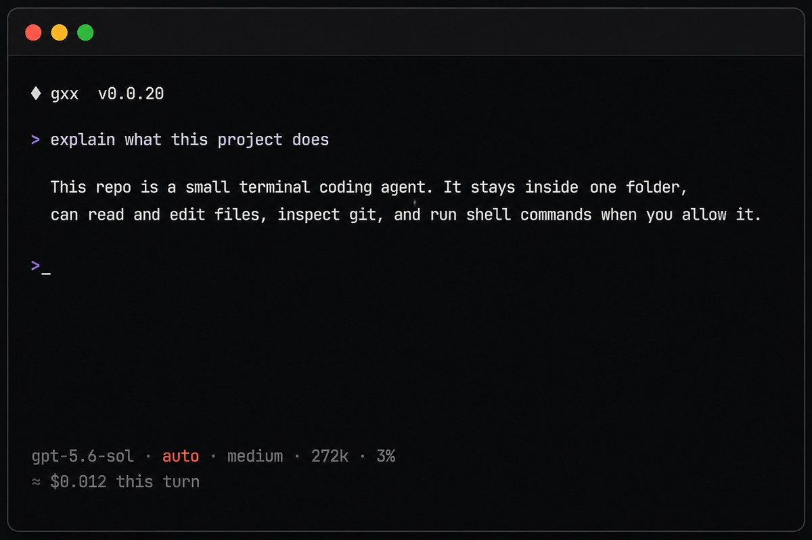
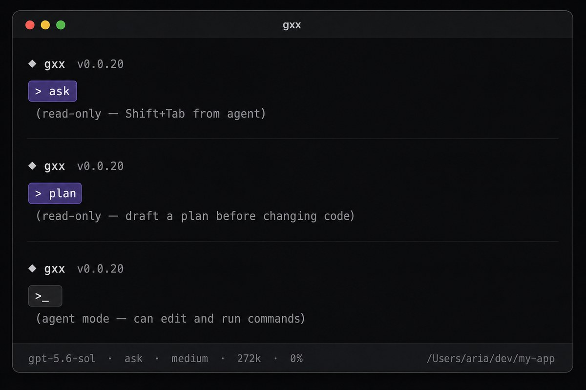
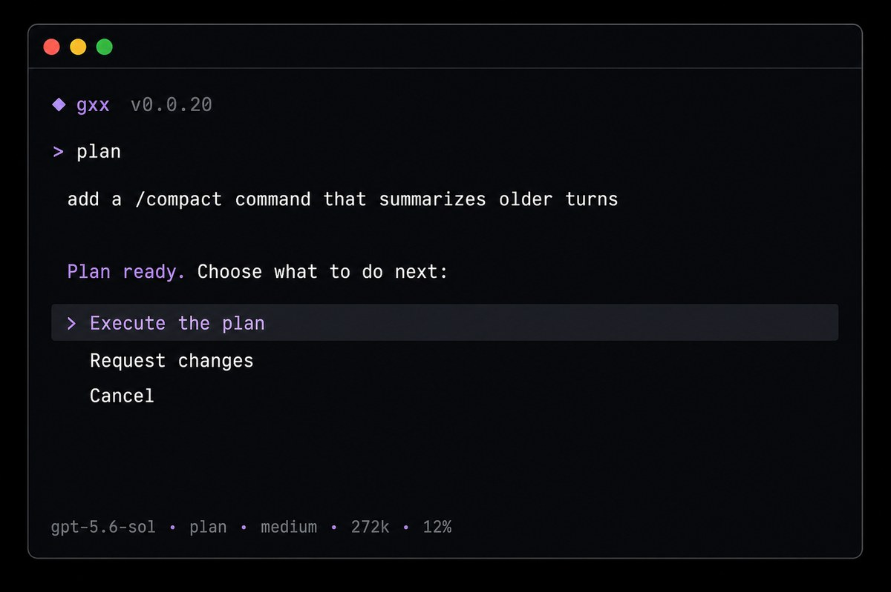

<div align="center">

```
 ██████╗ ██╗  ██╗██╗  ██╗
██╔════╝ ╚██╗██╔╝╚██╗██╔╝
██║  ███╗ ╚███╔╝  ╚███╔╝
██║   ██║ ██╔██╗  ██╔██╗
╚██████╔╝██╔╝ ██╗██╔╝ ██╗
 ╚═════╝ ╚═╝  ╚═╝╚═╝  ╚═╝
```

**A coding helper that lives in your terminal.**

Open a project folder, type what you want in plain language,
and gxx reads, edits, and runs things — only inside that folder.

[Website](https://demaarco.github.io/gxx/) · [Install](#install) · [How it works](#how-it-works) · [What it can do](#what-it-can-do)

[](https://demaarco.github.io/gxx/)
[](https://github.com/DeMaarco/gxx/releases)
[](LICENSE)
[](https://go.dev)
[](#install)

<br />



</div>

---

## Quick guide

Three steps. That’s the whole loop.

### 1. Install it

**macOS / Linux**

```sh
curl -fsSL https://raw.githubusercontent.com/DeMaarco/gxx/main/install.sh | sh
```

**Windows (PowerShell)**

```powershell
irm https://raw.githubusercontent.com/DeMaarco/gxx/main/install.ps1 | iex
```

Check that it works:

```sh
gxx version
```

### 2. Connect an account

You need **OpenAI** (API key or ChatGPT Plus/Pro/Team) or **Claude** (Pro/Max).

```sh
# OpenAI with an API key
export OPENAI_API_KEY="sk-..."

# or sign in
gxx login openai
# gxx login claude
```

On Windows (PowerShell):

```powershell
$env:OPENAI_API_KEY = "sk-..."
```

### 3. Open your project and type

```sh
cd your-project
gxx
```

Say what you want, for example:

- `explain this repository`
- `where is the port configured?`
- `fix the failing test`
- `add a save button to the form`

Press **Enter**. gxx reads the code, answers, and — when needed — proposes changes.

| Shortcut | What it does |
| --- | --- |
| `Shift+Tab` | Switch **agent** (can edit) · **ask** (questions only) · **plan** (plan before touching anything) |
| `/` | Slash commands (`/help`, `/model`, `/mode`…) |
| `Tab` | Complete or open pickers |
| `Ctrl+O` | Saved conversations for this project |
| `Ctrl+C` / `Ctrl+D` | Cancel or exit |

That’s enough to start. The rest of this page covers how it works and what’s unique.

---

## How it works

gxx is a small agent that sits in one folder — the project you open.

1. **You start it** inside a repo (`cd my-app && gxx`).
2. **You type** what you want in normal language.
3. **It looks around** that folder: lists files, searches, reads code, checks git.
4. **It answers**, and in agent mode it can edit files or run commands (with your permission settings).
5. **It never leaves** that folder. Outside paths and secret files (like `.env`) stay blocked.

You talk. It works in your project. Nothing fancy to learn first.

<p align="center">
  
</p>

**Three ways to talk to it** (press `Shift+Tab` to switch):

| Mode | Prompt | Best for |
| --- | --- | --- |
| **Agent** | `>` | Doing the work — edits and commands (with your permission rules) |
| **Ask** | `> ask` | Questions only — reads code, never changes anything |
| **Plan** | `> plan` | Think first — drafts a plan; then you choose execute, change, or cancel |

<p align="center">
  
</p>

The line under the prompt is your session at a glance:

```text
gpt-5.6-sol · auto · medium · 272k · 0%
```

model · permission · effort · context size · how full the window is

`auto` shows in red. Context turns yellow near 70% and red near 90%. After each turn you also see an estimated cost in USD.

---

## What it can do

- **Explain** a project, a file, or a confusing function
- **Find** where something lives (`search`, list folders, read files)
- **Inspect git** — status, diff, and log (read-only, same folder only)
- **Edit code** — apply patches when you allow it
- **Run commands** — tests, builds, scripts (you approve them in safer modes)
- **Generate images** into the project (needs an OpenAI platform API key)
- **One-shot answers** without the chat: `gxx ask "explain this repo"`
- **Scripts & pipes** — `echo "…" \| gxx ask` or `--json` for tools

Drop an `AGENTS.md` in the project root if you want extra project notes loaded every turn. Those notes cannot override gxx safety rules.

Agent Skills (`SKILL.md` under `.agents/skills`, `.gxx/skills`, or `~/.config/gxx/skills`) load as a name+description catalog each turn; `read_skill` fetches the body first when a skill matches. `/<name> <request>` forces that. After each write, `review_file` checks the file. See the [Skills](https://demaarco.github.io/gxx/skills/) docs.

---

## What makes gxx different

| | Why it matters |
| --- | --- |
| **One folder only** | The directory you start in is the whole world. No wandering into the rest of your disk. |
| **Ask / Plan built in** | Read-only modes with one key (`Shift+Tab`). Plan ends with a clear menu: execute, revise, or cancel. |
| **Secret-aware** | `.env`, keys, and credential paths are blocked on read, search, patch, git, and shell. |
| **Honest cost line** | After each turn, an estimated USD cost — rates refreshed from official OpenAI and Anthropic pricing. |
| **Eco mode** | `/eco` shrinks filler in requests (keeps code, paths, URLs) to save tokens. Session-only. |
| **Plain terminal** | No heavy TUI. A prompt, a status line, slash commands. Works over SSH. |
| **OpenAI or Claude** | API key, ChatGPT login, or Claude Pro/Max — pick what you already have. |

---

## Install

### macOS and Linux

```sh
curl -fsSL https://raw.githubusercontent.com/DeMaarco/gxx/main/install.sh | sh
```

Installs to `~/.local/bin`. If the shell cannot find it:

```sh
export PATH="$HOME/.local/bin:$PATH"
gxx version
```

Pin a version or install path:

```sh
curl -fsSL https://raw.githubusercontent.com/DeMaarco/gxx/main/install.sh | sh -s -- --version v0.0.23
curl -fsSL https://raw.githubusercontent.com/DeMaarco/gxx/main/install.sh | sh -s -- --dir /usr/local/bin
```

### Windows

```powershell
irm https://raw.githubusercontent.com/DeMaarco/gxx/main/install.ps1 | iex
```

Installs to `%LOCALAPPDATA%\gxx` and puts that folder on your PATH. Pin a version with `$env:GXX_VERSION = "v0.0.23"` before running the installer.

`run_command` uses PowerShell. Git tools need [Git for Windows](https://git-scm.com/download/win). Config lives in `%APPDATA%\gxx\config.json`.

---

## Connect OpenAI or Claude

**OpenAI** — [API key](https://platform.openai.com/api-keys), or ChatGPT (Plus/Pro/Team):

```sh
export OPENAI_API_KEY="sk-..."
cd your-project
gxx
```

```sh
gxx login openai
cd your-project
gxx
```

On machines without a browser, use `gxx login openai --device`.  
`OPENAI_API_KEY` wins over a saved key; a key wins over OAuth.

**Claude** — Pro/Max:

```sh
gxx login claude
cd your-project
gxx --model sonnet
```

`gxx login` without a provider opens a picker. `chatgpt` / `codex` are aliases for `openai`.

**One-shot** (no REPL):

```sh
gxx ask "explain this repository"
gxx ask --json "inspect the project"
echo "what does main.go do?" | gxx ask
gxx usage
```

---

## Permissions (when it can write)

Reads always run. **Ask** and **Plan** are read-only — no write approvals needed.

In **agent**, writes and shell follow `/mode`:

| Mode | Files | Shell |
| --- | --- | --- |
| `ask` | Preview + confirm | Preview + menu (or allow that exact command for the session) |
| `auto-writes` | Apply | Preview + menu |
| `auto` | Apply | Apply |

Prefer `ask` or `auto-writes` until you trust a workflow. Commands are not OS-sandboxed — review them when they matter.

---

## Useful commands

| Command | What it does |
| --- | --- |
| `/help` | List commands |
| `/model` | Switch models (Tab for context, effort, fast) |
| `/mode` | Agent permissions: `ask` · `auto-writes` · `auto` |
| `/eco` | Save tokens on input · `lite` `full` `ultra` |
| `/compact` | Summarize older turns to free context |
| `/config` | Save the OpenAI API key |
| `/login` / `/logout` | Connect or clear an account |
| `/context` | How full the window is |
| `/usage` | Tokens, estimated cost, remaining quota |
| `/history` | Saved conversations for this workspace |
| `/skills` | List discovered Agent Skills |
| `/clear` | Archive this chat and start fresh |
| `/exit` | Quit |

Inline forms work too: `/model opus`, `/mode auto-writes`, `/eco full`.

---

## Privacy (short version)

- Requests use `store:false` where the API supports it.
- Only files the tools actually open are sent to the provider (plus the Skills catalog each turn, and any `read_skill` bodies).
- Secret paths stay blocked.
- Keys and OAuth tokens live in an owner-only `config.json`.
- Do not point gxx at code you cannot send to that account.

---

## Build from source

Go 1.27+.

```sh
git clone https://github.com/DeMaarco/gxx.git
cd gxx
go install ./cmd/gxx
go test ./test/...
```

---

## License

Copyright 2026 DeMarco

Licensed under the [Apache License, Version 2.0](LICENSE).
